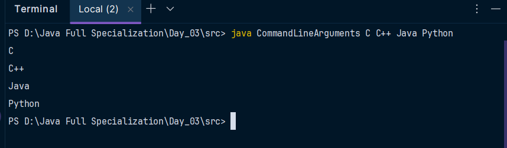
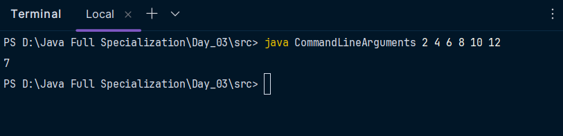
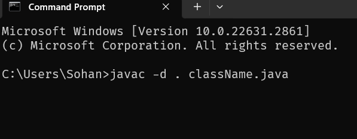

> # Java Core

<b><mark>Java is a popular programming language, created in 1995 by James Gosling.</mark>

<mark>IITian Vinod Khosla and Gosling in 1981 they create Sun Microsystem and vinod left and Gosling create Java which was known as Oak, Silk in past but finally JAVA...</mark>

## Advantages of Java : 
* <mark>Java works on different platforms (Windows, Mac, Linux, Raspberry Pi, etc.)
here, javac(java Compiler compile the code into .class files and these are called byte code) and interpeter(JVM). jvm is machine dependent but byte code machine independent...</mark>
* <mark>It supports multithreding(it's not multi-tasking) where multiple program runs at a time but not in real as the operations are fast so it seem at a time</mark>

* <mark>There is a feature of Garbage collection which is used to delete unused memory</mark>


* <mark>Automatic memory management means if we create a variable named a1 = 5 and and a2 = 5 then two variable indicate same memory address. </mark>

* <mark>Robust means in any situation it can be used...</mark>

* <mark>Many pre-defined classes.</mark>


<mark>javac compile kore and java run kore...</mark>

<mark>**File er nam ar class er nam same must...Jodi onek class thake taile dekhte hobe kon class e main function e thakbe seta onujai nam hobe...Class er first later boro hater and camel case.
function e pascal case..**.</mark>
</b>
```java
class Example {

	public static void main(String[] args){
		
		System.out.println("Hello I am Specializing Java Core");
	}

}
```

<mark>**Onno Function er Static Function call korte chaile oi class er nam.functionName() likha lagbe...**</mark>
```java
class Example {

	static void fun1(){
		System.out.println("A");
	}
	static void fun2(){
		System.out.println("B");
	}
	public static void main(String[] args){
		
		System.out.println("C");
		fun1();
		fun2();
		Example.fun1();//evabeo kaj kore... etai asol...

	//Onno Function er Static Function call korte chaile oi class er nam.functionName() likha lagbe...
		Area.fun1();
		Area.fun2();
	}

}
class Area{
	static void fun1(){
		System.out.println("Area1");
	}
	static void fun2(){
		System.out.println("Area2");
	}
}
```

<mark>**Jesob function static na segula ke non-static/ instance member function/ object member function bole...Egula onno class e use korte hooile age oi class er object create kore then object.func() diye call kora lagbe..**.</mark>

```java
public class Object1 {
    public static void main(String[] args){
        Obj2 obj2 = new Obj2();
        obj2.fun1();
        obj2.fun2();
        System.out.println(obj2.x);//prints 0
    }
}

class Obj2{
    int x;//Instance(object) member variable
    int y;//Instance(object) member variable
    void fun1(){//Instance (object) member function
        System.out.println("This is fun1 and it is non-static");
    }
    void fun2(){
        System.out.println("This is fun2 and it is instance member function");
    }
}
```


<mark>Java te uninitialized var e 0 thake...</mark>

<mark>We can also access static members using object.static_memberVar</mark>

#### <mark> _We can't call the static function by using the object. It is invoked by using the class name. But we can call the static member variable by object, but we don't need any object reference because static variables belong to a class._</mark>

```java
public class StaticMemberByObj {
    public static void main(String[] args) {
        //Access by class:
        System.out.println(Example.x);
        System.out.println(Example.b);
        Example.x = 43;
        System.out.println(Example.x);
        Example.showData();
        //Access by Obj :
        Example e1 = new Example();
//We can call the static member variable using object but not recommended...
        e1.x = 122;
        System.out.println(e1.x);
//We can't call the static function using the object...
        //e.showData();
        System.out.println(Example.x);
    }
}
class Example{
    private static int a;
    public static  int b = 5;
    static int x;
    public static void showData() {
        System.out.println(b +" "+x);
    }
}
```

<mark>**We can access private member variables using _getters and setters_**</mark>

```java
public class AccessingPrivateVar {
    public static void main(String[] args) {
        Demo d = new Demo();
        d.setter(54);
        d.getter();
    }
}
class Demo{
    private static int x;
    void setter(int x){
        Demo.x = x;
    }
    void getter(){
        System.out.println(x);
    }
}
```

### <mark>How Can we access private member variable Without creating objects?</mark>
<mark>We can achieve it by making getter and setter static...Then we can call them...</mark>

```java
public class AccessingPrivateVarWithoutObj {
    public static void main(String[] args) {
        Demo1.setter(123);
        Demo1.getter();
    }
}
class Demo1{
    private static int x;
    static void setter(int x){
        Demo1.x = x;
    }
   static void getter(){
        System.out.println(x);
    }
}
```

<mark>**Kono modifier na dile seta default access modifier...**</mark>

<mark>**Prottek Object er jonne alada alada vabe value assign hoi :** </mark>

```java
public class AccessingPrivateInstanceVar {
    public static void main(String[] args) {
        PrivateInstanceClass p1 = new PrivateInstanceClass();
        p1.fun1();
        p1.fun2();//5
        PrivateInstanceClass p2 = new PrivateInstanceClass();
        p2.fun2();//0
    }
}
class PrivateInstanceClass{
    private int x;
    void fun1(){
        x = 5;
    }
    void fun2(){
        System.out.println(x);
    }
}
```

<mark>**Ekta Java program e only ektai public class thakbe...Tai jetai main function thakbe seta kei public korbo, noile kawkei public korbo nah...**</mark>


<mark>**_Java te kono outer class private/protected hoi nah...Java te class er vitore class thakle vitorer ta innner class ebong eta privae/protected hoite pare. .._**</mark>


<mark>**main function static, internally Java compiler call the main function using classname.main()...**</mark>


> ### Wrapper Class :
Java is almost 100% Object-Oriented Language. Here, has primitive datatype and in this we can create programs without using objects. To make Java a 100% pure object-oriented programming language java introduced **"Wrapper class"** 


for 
* int -> Integer
* float -> Float
* char -> Character
* boolean -> Boolean
etc...

There is a static variable in **Integer** class, _parseInt()_ to convert anything to integer...it returns an int type
```java
int x = Integer.parseInt("123");
```

There is also static function **valueOf()** it returns an Integer type object...

```java
Integer x = Integer.valueOf("123");
```

There is a non-static function named intValue() which returns an int type value...

```java
Integer x = Integer.valueOf("123");
int num = x.intValue();
```
Ei 2 ta mile parseInt() eri kaj kore...
```java
public class WrapperClass {

    public static void main(String[] args) {
        // Integer num = new Integer(55); // Deprecated... Instead, use autoboxing.
        Integer num = 55;

        int numS = Integer.parseInt("45");
        System.out.println(num + numS); // Prints the sum of num and numS.

        Integer numX = Integer.valueOf("123");
        System.out.println(numX.getClass()); // Prints the class of numX (java.lang.Integer).

        int x = numX.intValue(); // Unwrapping: Converts Integer to int.

        System.out.println("The data type of x: " + Integer.valueOf(x).getClass().getSimpleName());//Integer...

        //Value of e base o pathano jai...Etai dara convert o kora jia number system...
        Integer bin = Integer.valueOf("1000111",2);
        //System.out.println(bin); works
        int binI = bin.intValue();
        System.out.println(binI);
    }
}
```

Sob wrapper class ei function gula ace...

> ## Command lin arguments : 

```java
public class CommandLineArguments {
    public static void main(String[] args) {
        for (String arg : args) {
            System.out.println(arg);
        }
    }
}
```


Average program using command line : 
```java
    public class CommandLineArguments {
        public static void main(String[] args) {
            int sum = 0, avg;
            for (String arg : args) {
                sum = sum + Integer.parseInt(arg);
            }
            avg = sum/args.length;
            System.out.println(avg);
        }
    }
```




> ## Package :
Package means folder in java...Similler type code ekjai rajhar jonne ar name conflict dur korar jonne...

Terminl theke package create korte hoile program er moddheei likha lagbe
```java
package packageName;
```
then, in command-line:


to run write java package2.className

class ke public na korle onno package theke setake import kora jabe nah...

>## Access Specifiers :
1. public->outside the class/program/package use korte parbe...
2. private->member private hole sudhu inside the class use kora jabe...
3. protected->inside the class, outside the class in same or different package but need to be subclass...
4. default->kono kisu na likhlei default...inside the class and outside the class but in same package...


> ## Constructor:


